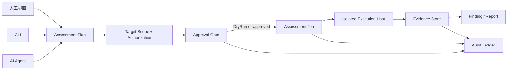

# 阶段 7：授权评估控制面方案

## 目标

把 Hackermes 从“浏览器调试与流量工作台”扩展为**仅面向已授权目标的评估工作区**。人工操作者、CLI 和 AI Agent 使用同一条受控执行链路：同一份目标范围、同一份执行计划、同一份审批状态，以及同一条可核验的证据链。

这不是在阶段 7 接入扫描器或利用工具。阶段 7 只建立可安全承载未来适配器的控制面；Nmap、目录枚举、漏洞利用、口令尝试、横向移动和规避功能均不在本阶段实现。

## 不可突破的约束

- 仅允许操作者明确拥有或已获书面授权的目标。每个工作区必须记录目标、授权说明、范围、失效时间和责任人。
- Agent 不获得任意系统 Shell、任意文件路径或任意网络目标的直接权限。它只能创建计划、读取已授权证据，并在人工审批后提交受限任务。
- 所有会产生外部影响的任务默认 `DryRun`；真实执行必须由人工确认，确认仅对指定任务、指定范围和有限时间有效。
- 执行端必须可取消、有超时和输出上限，并且只能调用注册表中允许的 Adapter；不得把“原始命令文本”作为 Agent 的通用执行入口。
- 证据、审批、撤销和失败均写入同一审计链。敏感请求体、认证头和凭据继续沿用现有脱敏与 DPAPI 存储原则。

## 统一工作流

人工、CLI 与 Agent 的差别仅是入口和呈现方式，不能绕过 `Target Scope`、`Approval Gate` 或审计。未来每一种工具都必须表现为同一个 `AssessmentJob`，而不是在各自页面里各写一套执行逻辑。

## 建议的模块与职责

| 模块 | 职责 | 依赖与禁止项 |
|---|---|---|
| `Hackermes.Assessment.Contracts` | 目标范围、授权、计划、任务、审批、证据、发现和审计的不可变契约 | 仅依赖 `Base`；不依赖 UI、CDP、Shell 或具体工具 |
| `Hackermes.Assessment` | 统一校验、状态机、审批、取消、结果归档与事件发布 | 依赖 Contracts、Platform；不直接启动进程 |
| `Hackermes.Assessment.Adapters` | 工具能力描述和模拟 Adapter；以后才放置受控的真实工具 Adapter | 不接受自由文本命令；每个 Adapter 声明能力、风险和输入上限 |
| `Hackermes.ToolHost`（后续独立进程） | 低权限、本地隔离执行、进程树管理、超时、输出截断与取消 | 只接受已签发任务令牌；不能被 Agent 直接调用 |
| `Hackermes.App` / `AiPanel` / `Terminal` | 分别提供人工、Agent、CLI 入口与任务状态展示 | 只调用 Assessment 的小接口，不保存第二份状态 |

这条拆分提高了深度与局部性：目标授权、审批和取消等复杂行为集中在 `Assessment`，调用方只需要提交计划或查看任务；增加第二个 Adapter 时才形成真实的适配器接缝。

## 核心领域对象

| 对象 | 最小字段 | 关键不变量 |
|---|---|---|
| `AssessmentScope` | ID、授权说明、责任人、目标集合、允许动作、创建/失效时间 | 目标必须规范化并受范围规则约束；失效后不可执行 |
| `AssessmentPlan` | Scope ID、步骤、风险摘要、预期证据、来源（人工/CLI/Agent） | Plan 只能引用注册的 Adapter 与结构化参数 |
| `ApprovalGrant` | Plan/Job ID、批准人、范围快照、失效时间、允许次数 | 不可转移；范围、计划或参数变化即失效 |
| `AssessmentJob` | 状态、运行令牌、开始/结束时间、取消原因、结果摘要 | 只能按 `Draft → AwaitingApproval → Queued → Running → Completed/Failed/Cancelled` 转移 |
| `EvidenceItem` | Job ID、时间、来源、脱敏载荷、完整性摘要 | 追加写；保留来源与生成版本 |
| `Finding` | 证据引用、严重性、置信度、人工复核状态 | Finding 不是执行权限，也不包含明文凭据 |

## 入口权限模型

| 入口 | 未审批时 | 审批后 | 永久禁止 |
|---|---|---|---|
| 人工界面 | 创建范围、编辑计划、运行模拟、查看证据 | 启动已批准任务、停止自己的任务 | 绕过范围、修改不可变审计 |
| CLI | 输出结构化计划预览、查询任务 | 以同一审批令牌提交任务 | 以任意 Shell 文本代替任务 |
| AI Agent | 读取脱敏证据、建议计划、请求审批 | 轮询结果、请求停止任务 | 获得系统级命令权限、扩大目标范围、静默执行 |

已有 `ToolPolicyGate` 继续负责 AI 工具层的风险决定；阶段 7 的审批不与它重复，而是增加“已授权目标和任务令牌”的业务前提。即使启用了 AI 信任模式，也不能跳过范围和审批。

## 人工界面草案

新增“授权评估”工作区（不占用当前左侧工具栏）：

1. **范围卡片**：目标、授权说明、有效期、允许的能力、责任人；失效和超范围项醒目标红。
2. **计划预览**：每一步的 Adapter、结构化参数、风险、`DryRun` 标记、预计时间/输出上限；不展示可复制的通用命令行。
3. **审批与撤销**：一次确认只绑定一个计划版本；可在排队或运行期间撤销，撤销立即触发取消。
4. **任务时间线**：状态变化、操作者、Agent 请求、取消、证据和错误汇集到单页。
5. **证据与发现**：查看脱敏原始输出、完整性摘要、人工复核、导出受控报告。

## 分阶段实施顺序

### 7A：控制面骨架（优先）

- 建立 Contracts、任务状态机、范围/授权存储和审批记录。
- 提供只在本机运行的 `SimulatedAdapter`，用于验证入口一致性，不产生任何外部网络行为。
- 做人工、CLI、Agent 三端的同一任务 ID、同一审计记录和同一取消语义。

### 7B：受控本地执行宿主

- 独立低权限 ToolHost、任务令牌、进程树取消、硬超时、输出/文件大小上限。
- 仅接入本地模拟或测试 Adapter；新增崩溃恢复与残留进程清理验证。

### 7C：证据闭环与协作

- 证据归档、Finding、报告导出、人工复核和 Agent 摘要。
- 审批撤销、操作者身份、审计查询与恢复演练。

### 7D：单独评审外部工具 Adapter（现在不开始）

只有在目标授权 UX、ToolHost 隔离和完整验收完成后，才单独评审某个外部工具 Adapter。届时按能力白名单、测试靶场和显式用户授权逐项决定；Nmap 仍作为未来候选，而非默认依赖。

## 与已列独立扩展的关系

| 扩展 | 建议优先级 | 与阶段 7 的关系 |
|---|---|---|
| 有界嵌套 JSON Pointer | P1 | 保持在 Traffic 参数编辑模块；复用范围/大小/深度限制，不阻塞 7A |
| 批量标注 | P1 | 作为 Traffic 工作台生产力功能；批处理需产生日志，但不需要 ToolHost |
| 复杂规则表单 | P1 | 将现有流量规则的 JSON 编辑收敛为结构化表单和预览；复用草稿/审计模型 |
| 审计操作者身份与撤销 | P0 | 是 Assessment 审批、取消和证据链的基础，优先进入 7A |
| 实际安全工具（含 Nmap） | 延后 | 必须等 7A–7C 验收和单独授权决策后再评审 |

## 验收门槛

- 越界、过期、被撤销或参数已变更的任务必须被拒绝，且不产生外部动作。
- 人工、CLI 和 Agent 对同一计划产生相同的 Scope/Plan/Job/Audit ID 关联。
- Agent 只能拿到脱敏证据；不得读取 DPAPI 密钥、原始凭据或 ToolHost 的泛用命令入口。
- 取消在排队和运行两种状态都可验证，运行中的子进程不能遗留。
- 重启后仍能校验审批、任务状态与证据完整性；审计不可被普通 UI 操作重写。
- 所有验证首先使用模拟 Adapter 或明确隔离的本地测试靶场，不对外部目标进行实际探测。

## 已实现基线（2026-08-09）

- `Hackermes.ToolHost` 已成为短生命周期独立进程，只读取标准输入中的签名 JSON 票据；不向 Agent 暴露进程路径或原始命令入口。
- 票据使用 Windows DPAPI 密钥仓中的 HMAC-SHA256 密钥，绑定 Job/Plan/Approval/Scope/Actor/精确目标/结构化步骤/期限；nonce 持久消费并拒绝重放。
- Approval 绑定冻结后的 Plan hash、过期时间且只允许消费一次；Scope 和未消费 Approval 均可撤销，执行、失败、取消和证据统一进入审计。
- 人工左侧页、`assessment` CLI 和 Agent 工具共享同一控制面；默认 Agent“请求批准”模式仍会在审批/运行工具层弹出确认。
- 首批受控 Adapter 为 Nmap 快速端口、Nmap 基础服务识别和 dirsearch 小字典路径发现。它们只接受结构化参数，精确匹配授权主机，限制端口数、并发、递归、重试、时长与输出；原始工具文件保持不变。
- 明确不注册 `E:\tool` / `F:\racetools` 中的漏洞利用、口令爆破、横向移动、规避和破坏类工具。新增 Adapter 必须逐项评审并增加 loopback 测试。

## 当前决定

阶段 7 的第一个可交付物是 7A，而不是安全工具页面。这样既能让人和 Agent 在同一软件中协作，也把将来的高风险能力关在可审计、可撤销、可验证的受控执行面之后。
